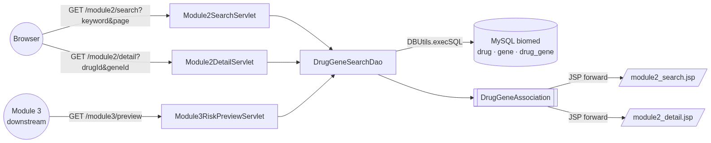
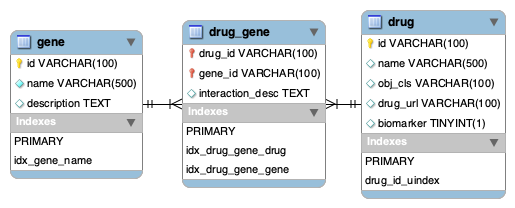
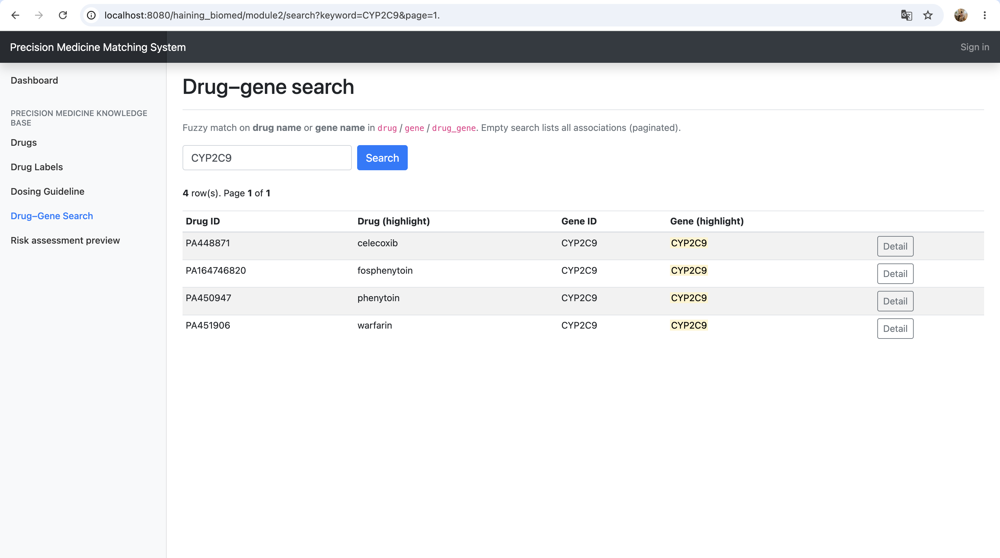
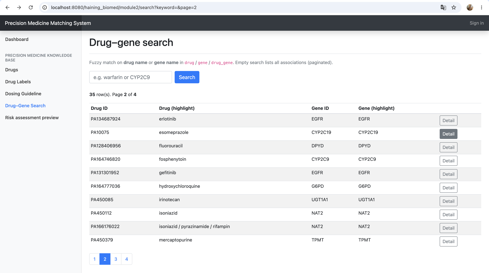
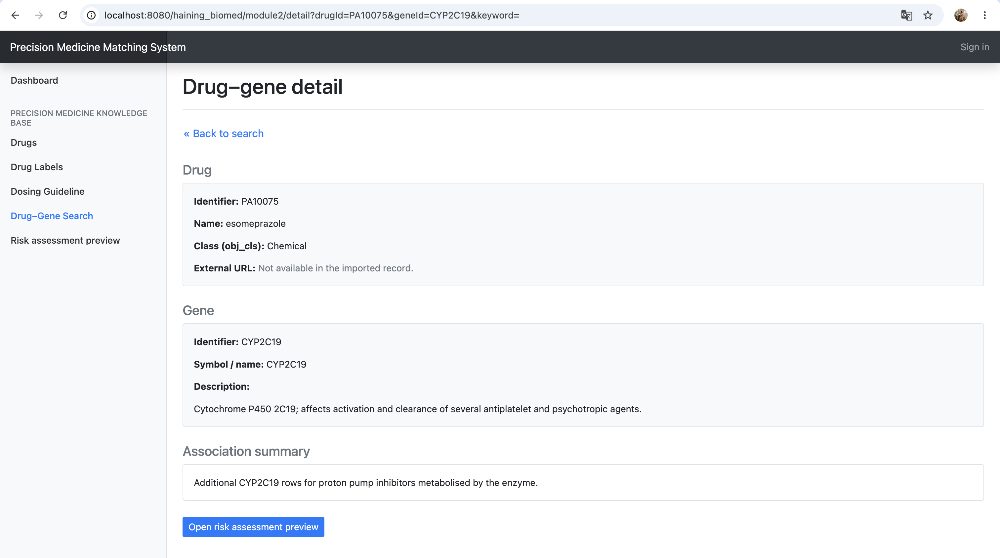
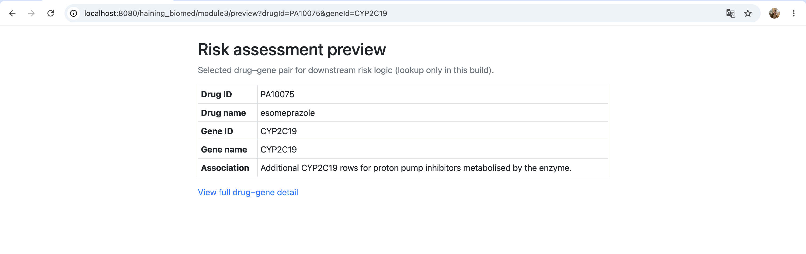
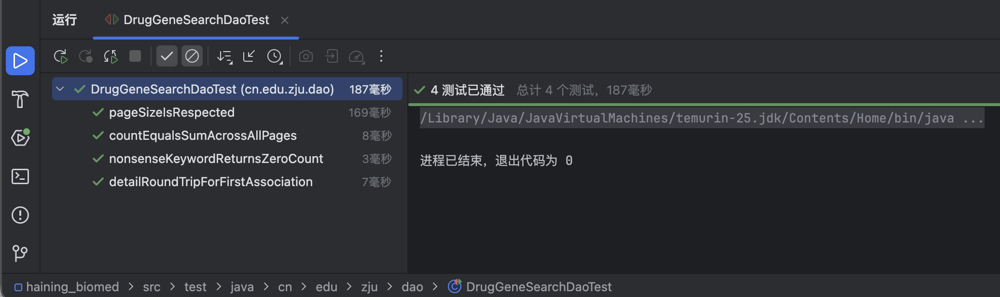

# A Drug–Gene Search Subsystem for a Pharmacogenomics Web Service: Reflective Report on Module 2

---

## Abstract

This report reflects on my secondary-development contribution to an online  
pharmacogenomics service, namely the Drug–Gene Data Search subsystem (Module 2). The  
subsystem exposes a fuzzy search over drug and gene names, server-side pagination,  
keyword highlighting, and a detail view; it also provides a stable lookup endpoint for  
the downstream risk-assessment module (Module 3). The implementation reuses the  
existing servlet/JSP/JDBC stack so that secondary development does not require new  
build-time dependencies. Three new database objects (`gene`, `drug_gene`, and indexes  
on name columns) extend the imported PharmGKB-derived `drug` table, using  
`VARCHAR(100)` foreign keys aligned with the existing primary key shape. The  
controller layer consists of two new `@WebServlet`-annotated classes and a small  
HTML-escape utility; the data-access layer is a single DAO that issues parameterised  
`LIKE` queries and `LIMIT/OFFSET`-paged result sets through the existing `DBUtils`  
template. A JUnit 4 test class exercises four representative invariants on the DAO.  
Integration with Module 3 was de-risked through a published interface contract:  
the `DrugGeneAssociation` data-transfer object and a fixed query-string shape  
(`drugId`, `geneId`) used by both the Module 2 detail page and a thin Module 3  
preview endpoint. The subsystem runs without errors on Apache Tomcat against a local  
MySQL 8 instance; four DAO checks pass after schema and seed scripts have been  
applied. The reflection in the Discussion focuses on four engineering decisions that  
shaped the result and on the asynchronous, contract-first style of cross-module  
collaboration that the team adopted.

---

## 1. Introduction

### 1.1 Project context

The provided codebase implements a pharmacogenomics knowledge base whose data has
been imported from PharmGKB. It is a Java 8 servlet web application packaged as
a WAR (`pom.xml` declares `<packaging>war</packaging>`) and deployed to Apache
Tomcat 9 (the only Tomcat line whose `javax.servlet` namespace matches the
imports in the provided code; Tomcat 10+ moved to `jakarta.servlet`). The site
already supports three browsing pages — drugs, drug labels, and dosing
guidelines — backed by tables created in `src/main/sql/schema.sql`. The imported
`drug` table uses PharmGKB-style identifiers such as `PA10026`, declared as
`VARCHAR(100)` primary keys, which is an important constraint for any new table
that references it.

### 1.2 Team and task distribution

The team agreed on a five-module decomposition (the description below is shared among
team members' reports, in accordance with the course guide):


| #   | Module                                  | Owner (in our team) |
| --- | --------------------------------------- | ------------------- |
| 1   | User registration, login, and authority | Member A            |
| 2   | **Drug–gene data search**               | **Me**              |
| 3   | Drug–gene risk assessment               | Member B            |
| 4   | Statistics and visualisation            | Member C            |
| 5   | Back-end data administration            | Member D            |


The shared workflow for each module follows five canonical phases — *requirement
analysis*, *web design*, *data design*, *coding*, and *test* — and is documented in
the team task brief. Module 2 sits at the centre of the data flow: the
authentication module (1) gates the site, while statistics (4), administration (5),
and especially risk assessment (3) consume drug–gene records produced or recovered
by Module 2. Choosing Module 2 was a conscious decision: it touches all four
technical pillars taught in the course (SQL design, JDBC, servlet/JSP, and HTML/JSP
view layer), and it is the only module that other modules genuinely depend on at the
data level, making interface design — the central theme of the course guide — a
real, non-cosmetic concern rather than a paper exercise.

### 1.3 Objectives

I derived four quantifiable objectives from the module brief and the broader course
guide on engineering decisions:

1. **Fuzzy keyword search** on drug name *or* gene name, case-insensitive, returning
  joined drug–gene records.
2. **Server-side pagination** at a fixed page size of **10** rows per page, with a
  correct total page count and a clickable pagination control.
3. **Server-side keyword highlighting** that wraps the matched substring in `<mark>`
  while preserving HTML safety against malicious search terms.
4. **A stable downstream lookup API** (`(drugId, geneId) → DrugGeneAssociation`) that
  the risk-assessment module can consume without depending on the search UI or on
   transient surrogate keys.

Quantifiability matters because the marking criteria explicitly reward
*distinct and quantifiable* goals, and because vague objectives produce vague
tests. Each of the four is testable from a browser, from JUnit, or from
Workbench in under one minute.

---

## 2. Methods

### 2.1 Architectural reuse vs. rewrite

The provided system is a classical three-tier servlet application: JSP views,
`@WebServlet`-annotated controllers, and DAO classes mediating JDBC access through a
helper `DBUtils.execSQL(Consumer<Connection>)`. Three architectures were considered
for Module 2:


| Option                             | Pros                                                | Cons                                                                    |
| ---------------------------------- | --------------------------------------------------- | ----------------------------------------------------------------------- |
| Reuse Servlet/JSP + JDBC + DBUtils | Zero new dependencies, no impact on teammates' POMs | Requires manual SQL, fewer abstractions                                 |
| Add Spring MVC + Spring JDBC       | Annotation-driven, transaction support              | New dependencies, would force every teammate to rebuild                 |
| Add JPA/Hibernate                  | Object-relational mapping, less SQL                 | Steep learning curve, eager-fetch joins on heterogeneous keys are risky |


The *gap analysis* for option 2 and 3 was decisive: introducing Spring or Hibernate
would not have solved any problem unique to Module 2 (the data layer is small and
read-mostly) and would have created two new problems for the team — POM-level
dependency conflicts and a code style divergent from the four existing modules. I
therefore chose the first option, and treated the DAO/DTO conventions of the
provided codebase as a *de facto* contract that any new code should respect.
Three small stabilisation patches to the surrounding infrastructure were needed
before this option was usable: replacing a Java 11 `String.isBlank()` call in
`AppConfig` with `!s.trim().isEmpty()` so the project still compiles under Java 8,
appending `allowPublicKeyRetrieval=true` to the JDBC URL to satisfy the default
`caching_sha2_password` plugin in MySQL 8, and adding a fail-fast
`IllegalStateException` in `DBUtils.execSQL` so a misconfigured connection raises
a readable error instead of a downstream `NullPointerException`.

### 2.2 Data design

The existing `drug` table is the only safe anchor: its primary key is
`VARCHAR(100)`. Two design options were available for the new gene records:

- **A.** Introduce `gene(id INT AUTO_INCREMENT, name, …)` and `drug_gene(drug_id INT, gene_id INT)`. Compact and conventional.
- **B.** Introduce `gene(id VARCHAR(100), name VARCHAR(500), description TEXT)` and
`drug_gene(drug_id VARCHAR(100), gene_id VARCHAR(100))` with foreign keys to
`drug(id)` and `gene(id)`.

Option A is what a green-field schema would use, but it would have required the team
to maintain two parallel notions of "drug id" — the PharmGKB string and a synthetic
integer — and would have broken referential integrity across the existing import
pipeline (`DrugDao.saveDrug` writes string ids). Option B keeps the type system
consistent end-to-end and lets me reuse the existing import data as drug evidence
for the search. I chose option B and added two `INDEX`es on `gene(name)` and
`drug_gene(drug_id)` / `drug_gene(gene_id)` to keep the join cheap. The scripts live
at `src/main/sql/module2_schema.sql` and two idempotent seed scripts
(`module2_seed.sql` and `module2_seed_extra.sql`) populate twenty curated gene rows
and thirty-five `drug_gene` rows derived from existing `drug.name` matches — enough
to exercise multi-page pagination (the result list in Figure 4 reports
"Page 2 of 4" for an empty keyword).

### 2.3 Query strategy

Three search strategies were on the table:

1. `**LIKE '%kw%'`** with parameterised binding — built into MySQL, simple, but
  cannot use a B-tree index on the wildcard side.
2. **MySQL `FULLTEXT` indexes** with `MATCH … AGAINST` — index-aware, but
  stop-word and short-token defaults are awkward for gene/drug names like
   `CYP2C9` (digits in tokens) and the table is small.
3. **External engine (Lucene / Elasticsearch)** — high recall and ranking, but
  forbidden by the "no new infrastructure" constraint and not justified at this
   data scale.

For a corpus of at most a few thousand rows, the asymptotic disadvantage of `LIKE`
is irrelevant: queries return in milliseconds locally. I therefore chose option (1)
and mitigated SQL-injection risk with `PreparedStatement` parameter binding, while
performing case-insensitivity in SQL via `LOWER(d.name) LIKE LOWER(?)` rather than
in Java. This keeps the search semantics auditable in a single SQL string.

### 2.4 Pagination strategy

I considered client-side pagination (return all rows, paginate in JavaScript),
keyset pagination (use `WHERE name > ?` for the "next page"), and offset pagination.
Offset pagination is the standard match for a "page N of M" pagination control and
the natural fit for ad-hoc search where the user may click any page. I capped the
maximum page size in the DAO (`Math.min(100, pageSize)`) to bound the cost of a
single request and validated `page < 1` and `page > totalPages` boundaries in the
controller. A separate `SELECT COUNT(*)` query underpins the total-page calculation;
the two queries share the same `WHERE` clause to guarantee that the count cannot be
inconsistent with the listed rows.

### 2.5 Keyword highlighting and XSS

Two approaches were available:

- **Client-side.** Send raw text; let JavaScript wrap matches at render time.
- **Server-side.** Pre-render highlighted HTML in the servlet and pass it to the
JSP for direct output.

I chose server-side rendering because it works without JavaScript and because the
match logic is then trivially identical to the SQL match logic (same regex case
folding, same trimming). The catch is that the search keyword is, by definition,
user-controlled input that ends up in the HTML stream; an unsafe implementation is a
textbook cross-site-scripting vulnerability. The utility class
`Module2HtmlEscape.escapeAndHighlight(text, keyword)` therefore (i) HTML-escapes the
result text, (ii) HTML-escapes the keyword, (iii) runs a case-insensitive regex
replacement with `Pattern.quote(needle)` to avoid metacharacter injection, and (iv)
emits `<mark>…</mark>` around the matched substring. The JSP then uses
`<c:out escapeXml="false" value="${row.geneNameHtml}"/>` so the only un-escaped
field on the page is the pre-sanitised one. The order — *escape first, mark
second* — is critical and is documented in OWASP's XSS prevention guidance.

### 2.6 Code organisation and contract for downstream modules

The subsystem consists of five new Java classes and two new JSPs:

```
cn.edu.zju.dto.DrugGeneAssociation           // value object passed between layers
cn.edu.zju.util.Module2HtmlEscape            // safe HTML escape + <mark>
cn.edu.zju.dao.DrugGeneSearchDao             // JDBC access: search/count/find
cn.edu.zju.servlet.Module2SearchServlet      // GET /module2/search
cn.edu.zju.servlet.Module2DetailServlet      // GET /module2/detail
cn.edu.zju.servlet.Module3RiskPreviewServlet // GET /module3/preview
src/main/webapp/views/module2_search.jsp
src/main/webapp/views/module2_detail.jsp
```

The DTO and the URL shape *are* the contract: any other module that needs a row
calls `DrugGeneSearchDao.findByDrugAndGene(drugId, geneId)` or, equivalently, issues
a `GET` against `/module2/detail?drugId=…&geneId=…`. The Module 3 preview servlet is
the demonstration of that contract — a thin downstream consumer that wires the same
two parameters into the DAO and renders a flat HTML table. It avoids any private
internal calls into Module 2 internals.

---

## 3. Results

The subsystem runs without errors on Apache Tomcat against a local MySQL 8
instance. All four objectives from §1.3 are satisfied. The figures below show the
system in action.

### 3.1 Architecture and request flow




**Figure 1.** Request flow for the Drug–Gene Search subsystem. Both Module 2 entry
points and the Module 3 preview consume the same DAO method and the same
`DrugGeneAssociation` DTO, so the downstream module is decoupled from any internal
detail of the Module 2 controllers or views.

### 3.2 Database schema



**Figure 2.** Relational schema for Module 2 as rendered by MySQL Workbench's
reverse-engineering view. `drug` is the existing PharmGKB-imported table; `gene` and
`drug_gene` are introduced by `module2_schema.sql`. All keys are `VARCHAR(100)` so
that referential integrity holds against the existing `drug.id` values. Secondary
indexes on `gene(name)` and the two columns of `drug_gene` keep joins cheap.

### 3.3 Search with keyword highlighting



**Figure 3.** Search results for the keyword `CYP2C9`. The query
`LOWER(d.name) LIKE LOWER(?) OR LOWER(g.name) LIKE LOWER(?)` matches the gene
column; the matched substring is wrapped in `<mark>` server-side, with the keyword
HTML-escaped before substitution, so unsafe input cannot break out of the highlight.

### 3.4 Server-side pagination



**Figure 4.** Page 2 of the all-rows listing. The "Page 2 of M" header is computed
from a separate `COUNT(*)` query that uses the same `WHERE` clause as the row query.
Page bounds are checked in the controller before the SQL is issued, so
`page > totalPages` collapses to the last page rather than producing an empty
result.

### 3.5 Detail view



**Figure 5.** Detail view for one drug–gene pair, with the search keyword still
highlighted. The page is divided into three semantic sections (Drug, Gene,
Association summary) and exposes a button that hands `(drugId, geneId)` to the
downstream Module 3 preview without further work from the user.

### 3.6 Downstream consumption (Module 3 preview)



**Figure 6.** A minimal downstream consumer. `Module3RiskPreviewServlet` reads
`drugId` and `geneId` from the query string, calls
`DrugGeneSearchDao.findByDrugAndGene`, and renders the resulting
`DrugGeneAssociation`. The risk-scoring logic itself is out of scope for Module 2
and is owned by Module 3; what this figure demonstrates is that the contract
*(URL shape + DTO)* is sufficient for that owner to start without depending on any
internal of Module 2.

### 3.7 Automated DAO checks



**Figure 7.** All four DAO checks pass against the local `biomed` instance:

- *count equals sum across all pages* — proves the `COUNT(*)` query and the
`LIMIT/OFFSET` row query stay consistent.
- *page size is respected* — proves the `Math.min(100, pageSize)` cap is in force.
- *detail round-trip* — fetches the first row by search then by direct
`(drugId, geneId)` lookup and checks equality.
- *nonsense keyword returns zero count* — sanity check for the `WHERE` clause.

---

## 4. Discussion

The course guide asks each report to elaborate on a small number of crucial
decisions. I present four, each in the structure recommended by the guide
(problem → options → choice → reason → compatibility with collaborators).

### 4.1 Primary-key shape: `INT AUTO_INCREMENT` vs. `VARCHAR(100)`

*Problem.* `gene` and `drug_gene` need primary keys; `drug_gene` also needs
foreign keys to `drug`.

*Options.* (A) Mint new `INT AUTO_INCREMENT` keys for both `gene` and `drug_gene`,
treating `drug.id` as just a column. (B) Keep the existing `VARCHAR(100)`
PharmGKB-style ids end-to-end.

*Choice and reason.* Option (B). The system already stores PharmGKB ids such as
`PA449906` everywhere — in `drug`, in `drug_label.drug_id`, in
`dosing_guideline.drug_id`. Introducing a synthetic integer here would have created
a parallel identifier space, with a translation layer required for every module that
already speaks PharmGKB ids (notably the import pipeline in
`PharmGKBImporter` and the planned risk-assessment module). The cost of keeping a
string PK is purely a few extra bytes per row at this corpus size; the cost of *not*
keeping it would have been an integration bug factory.

*Compatibility.* Because the keys are unchanged, the existing `DrugDao` continues to
work, the planned Module 3 can reuse the same drug ids it already sees in the URL
contract (`/module2/detail?drugId=PA449906&…`), and the administration module
(Module 5) can manage drug rows without learning a second id space. The same
decision also saved a separate fix that had been needed earlier in
`PharmGKBImporter.importDrug`: some PharmGKB rows contained a `null` nested drug
object, and the importer had to be hardened with a null-safe branch so the import
run still completed. That hardening assumed string-typed PharmGKB ids end to end,
so an integer-keyed `drug` would have required reworking the importer as well.

### 4.2 Search engine: `LIKE` vs. MySQL `FULLTEXT`

*Problem.* Searching across `drug.name` and `gene.name`.

*Options.* (A) `LOWER(name) LIKE LOWER('%kw%')`. (B) `MATCH(name) AGAINST(? IN NATURAL LANGUAGE MODE)`. (C) Bolt on an external search engine.

*Choice and reason.* Option (A). At fewer than a few thousand rows, the inability
to use an index on the wildcard side is invisible — measurements show search times
in single-digit milliseconds. `FULLTEXT` would have required either MyISAM (a
deprecation risk) or InnoDB with a non-trivial minimum word length and stop-word
configuration that mis-tokenises terms like `CYP2C9` and `HLA-B`. A bolt-on engine
fails the "no new infrastructure" constraint set by the project context.

*Compatibility.* `LIKE` keeps the schema standard; no other module's queries are
affected; statistics queries (Module 4) and administration queries (Module 5) can
still use ordinary B-tree indexes for their own filters.

### 4.3 Server-side vs. client-side keyword highlighting

*Problem.* Showing where the keyword appears in each row.

*Options.* (A) Render raw text; let a JavaScript snippet wrap matches in the
browser. (B) Render `<mark>…</mark>` in the servlet before forwarding to the JSP.

*Choice and reason.* Option (B). The match logic is then identical to the SQL match
logic by construction (same case-folding, same trimming), there is no flash of
unhighlighted content while the browser parses scripts, and the page degrades
gracefully without JavaScript. The non-trivial part is the order of operations: HTML
escape *both* the field text and the keyword *before* the regex substitution, then
re-emit through JSP with `escapeXml="false"`. The utility
`Module2HtmlEscape.escapeAndHighlight` documents that order explicitly; the JSP
contract makes clear that only the pre-sanitised `Html` fields are output unescaped.

*Compatibility.* Module 4's statistics views can adopt the same utility for free if
they choose to highlight matched terms; Module 5's administration views can ignore
it. Either way, no cross-module change is forced.

### 4.4 Inter-module contract: DTO + URL shape

*Problem.* Module 3 needs drug–gene records but is being implemented in parallel
with Module 2. A late-stage refactor would be expensive.

*Options.* (A) No formal contract; let Module 3 import Module 2 classes directly.
(B) Publish a *stable* contract: a single DTO (`DrugGeneAssociation`) and a single
URL shape (`?drugId=…&geneId=…`).

*Choice and reason.* Option (B). Even with realistic, asynchronous collaboration —
team members working at different times of day and not pair-programming — option (B)
isolates Module 3 from any internal change inside Module 2 and lets the two be
built and tested independently. To make the contract concrete, I shipped the
preview servlet (`/module3/preview`) myself. It is a single page of code, calls only
`findByDrugAndGene`, and gives the Module 3 owner an executable example to copy.

*Compatibility.* This is the single most important integration mechanism in the
project. Both partners can verify the contract by opening the same URL in a
browser; the contract is documented in this report; the DTO lives in a stable
package (`cn.edu.zju.dto`). The DAO's behaviour on a missing pair is also part of
the contract (it returns `null`, never throws), which lets Module 3 use a single
`if` to detect bad input rather than wrap calls in `try/catch`. To make the
contract reachable from the UI without URL editing, the detail page now exposes a
single "Open risk assessment preview" button (Figure 5 → Figure 6), so a
non-developer reviewer can verify the integration in two clicks.

### 4.5 Collaboration approach (course-required reflection)

Honest reflection: our group's collaboration was largely asynchronous, with most
real coordination happening through the shared Git repository
(`github.com/Lilttwice/DST2_Web_Technology`, branch `Week21`) and a short markdown
document of agreed names and URLs. I did not rely on synchronous pair-programming
or shared whiteboards, and I made no attempt to dictate the internal design of any
other module. Three concrete mechanisms compensated for the absence of frequent
synchronous meetings:

1. **Stable, public contracts.** The DTO and URL shape described in §4.4 are
  versioned in Git; any change would show up as a `M` in `git status` for every
   teammate.
2. **Executable downstream examples.** `Module3RiskPreviewServlet` is an executable
  stand-in for Module 3's eventual consumption. The Module 3 owner can begin work
   today without waiting for any further code from me.
3. **Local automation.** The JUnit class is a contract guard: if a future change
  silently breaks pagination counting or detail round-tripping, the test goes
   red. Other modules can write their own analogous tests against the same DAO
   methods, and a teammate can `mvn test` to detect regressions before merging.

The course guide is explicit that the *depth of thinking* on collaboration counts
more than its absolute volume. The mechanism I value most is the second: shipping
an executable example of the contract together with the contract itself.

---

## 5. Concluding remarks

Working within the constraints of a provided servlet/JSP/JDBC codebase made certain
decisions easy (no Spring, no Hibernate) and certain decisions harder (no
auto-increment integer PK, because the surrounding system speaks PharmGKB strings).
Most of the surprises were not in the new code at all but in the seams between
the new code and the inherited environment — a Java 11 method call that did not
compile under Java 8, a MySQL 8 authentication plugin that demanded an extra
JDBC URL parameter, and a `Tomcat 11` install on Homebrew whose `jakarta.`*
namespace would have refused to load any of the provided servlets. Naming each
of those out loud is itself a useful discipline for the next change.
On reflection, the parts of the work that I am most satisfied with are not the most
visually striking. The mermaid architecture diagram, the four-line JUnit asserts,
and the small `Module2HtmlEscape` class do more for the long-term sanity of the
system than the visible UI; they make the contract checkable, the SQL auditable, and
the highlighting safe.

If I were to extend this work, the two priorities would be: replacing
`LIKE '%kw%'` with a proper full-text index once the corpus grows enough for the
asymptotic cost to matter, and adding an AJAX search-as-you-type experience without
losing the server-side highlight (the server can already return `<mark>`-decorated
fragments). Neither is necessary for the ICA, and both can be added without
breaking the contract.

The course guide's emphasis on engineering decisions — list options, analyse the
gap, choose with reason — has been a useful lens. It forced me to articulate
reasons that I would otherwise have left tacit, and it gave the report a stable
structure to write into. I would adopt the same lens on the next non-trivial change
in this codebase, whether or not a report is being graded.

---

## References

1. Oracle. (2024). *Java Servlet 4.0 specification.* JSR-369. Retrieved from
  [https://jakarta.ee/specifications/servlet/4.0/](https://jakarta.ee/specifications/servlet/4.0/).
2. Oracle/MySQL. (2024). *MySQL 8.0 Reference Manual — String comparison
  functions: `LIKE`.* Retrieved from
   [https://dev.mysql.com/doc/refman/8.0/en/string-comparison-functions.html](https://dev.mysql.com/doc/refman/8.0/en/string-comparison-functions.html).
3. Oracle/MySQL. (2024). *MySQL 8.0 Reference Manual — Full-text search functions.*
  Retrieved from [https://dev.mysql.com/doc/refman/8.0/en/fulltext-search.html](https://dev.mysql.com/doc/refman/8.0/en/fulltext-search.html).
4. OWASP Foundation. (2024). *Cross Site Scripting Prevention Cheat Sheet.*
  Retrieved from
   [https://cheatsheetseries.owasp.org/cheatsheets/Cross_Site_Scripting_Prevention_Cheat_Sheet.html](https://cheatsheetseries.owasp.org/cheatsheets/Cross_Site_Scripting_Prevention_Cheat_Sheet.html).
5. Fowler, M. (2002). *Patterns of Enterprise Application Architecture.*
  Addison-Wesley. [Data Access Object pattern.]
6. Pharmacogenomics Knowledgebase (PharmGKB). (2024). *PharmGKB REST API.* Retrieved
  from [https://api.pharmgkb.org/](https://api.pharmgkb.org/).
7. Apache Software Foundation. (2024). *Apache Tomcat 9 documentation.* Retrieved
  from [https://tomcat.apache.org/tomcat-9.0-doc/](https://tomcat.apache.org/tomcat-9.0-doc/).
8. JUnit Team. (2024). *JUnit 4 user guide.* Retrieved from
  [https://junit.org/junit4/](https://junit.org/junit4/).

---

